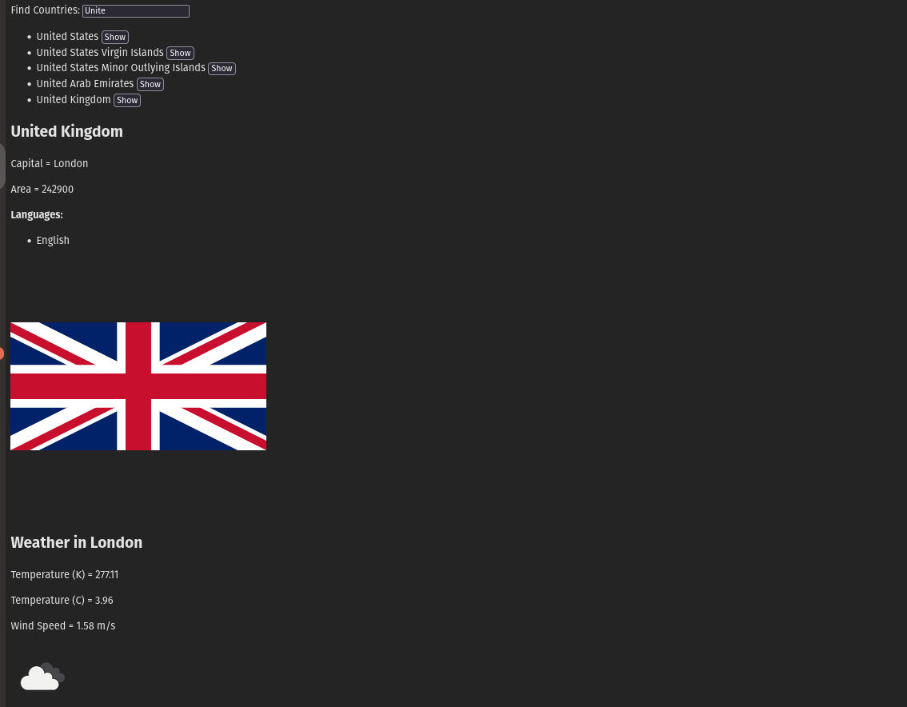

# Countries app

Using https://studies.cs.helsinki.fi/restcountries/ for countries data.

Using https://openweathermap.org for weather data.

The API KEY for the weather data should be saved as follows (refer to openweathermap.org on how to get one):

```
//.env file in the root folder of the project
OPENWEATHER_API_KEY=00de5abd6b82c7a62be09e58bdbb9cf4
```

The start.sh script will use this configuration:

```bash
#!/usr/bin/env bash
export OPENWEATHER_API_KEY=$(cut -d"=" -f2) && npm run dev
```

[!]
